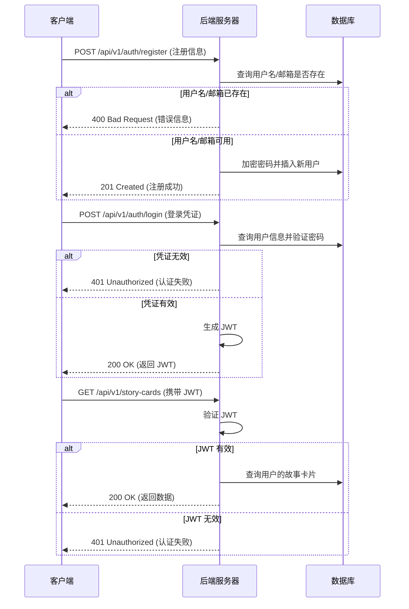

# AINovel 系统详细设计文档
CHARACTER_CHANGE_LOG {
    Long id PK
    Long character_id FK
    Long manuscript_id FK
    Long outline_id FK
    Integer chapter_number
    Integer section_number
    String newly_known_info
    String character_changes
    String character_details_after
    Boolean is_auto_copied
    Boolean is_turning_point
    Json relationship_changes
    DateTime created_at
    DateTime updated_at
}

## 1. 功能设计

### 1.1. 用户认证 (User Authentication)

#### 1.1.1. 功能描述
用户认证模块负责管理用户的注册、登录和会话，确保只有授权用户才能访问其个人数据和创作内容。系统采用基于 JWT (JSON Web Token) 的无状态认证机制。

#### 1.1.2. 用户流程

1.  **用户注册**:
    *   新用户访问注册页面，输入用户名、邮箱和密码。
    *   前端对输入进行基本校验（如格式验证、密码强度）。
    *   点击“注册”按钮，前端将用户信息发送至后端 `/api/v1/auth/register` 接口。
    *   后端服务对用户名和邮箱的唯一性进行校验。
    *   校验通过后，对密码进行加密处理，并将新用户信息存入 `users` 表。
    *   返回注册成功或失败的消息。

2.  **用户登录**:
    *   已注册用户访问登录页面，输入用户名和密码。
    *   点击“登录”按钮，前端将凭证发送至后端 `/api/v1/auth/login` 接口。
    *   后端服务验证用户名是否存在以及密码是否匹配。
    *   验证成功后，生成一个包含用户ID和权限信息的 JWT，并返回给前端。
    *   前端将 JWT 存储在本地（如 `localStorage`），并在后续的 API 请求中通过 `Authorization` 请求头携带该 Token。

3.  **会话管理**:
    *   JWT 具有预设的过期时间。
    *   前端在每次路由切换或发起关键 API 请求前，检查 JWT 是否存在且未过期。
    *   如果 JWT 过期，前端将自动清除本地存储的 Token，并引导用户返回登录页面。
    *   后端通过一个 `JwtRequestFilter` 过滤器拦截所有受保护的 API 请求，验证请求头中的 JWT 是否有效。如果无效或过期，则拒绝访问。

#### 1.1.3. 交互序列图 (Mermaid)



### 1.2. 故事构思 (Story Conception)

#### 1.2.1. 功能描述
此模块允许用户输入一个简单的想法或关键词，系统通过 AI 生成一个包含故事背景、核心情节、世界观和主要角色的完整故事设定。生成的内容以“故事卡”和“角色卡”的形式进行管理。

#### 1.2.2. 用户流程

1.  **生成故事**:
    *   用户在故事构思页面输入故事想法（如“一个赛博朋克侦探调查一宗仿生人失踪案”）、故事类型和基调。
    *   点击“生成”按钮，前端将请求发送至 `/api/v1/conception` 接口。
    *   后端 `ConceptionService` 根据用户的 AI 设置（模型、API Key）选择对应的 `AiService` 实现（如 `OpenAiService`）。
    *   服务构建一个详细的 Prompt，要求 AI 生成包含 `storyCard` 和 `characterCards` 的 JSON 对象。
    *   AI 返回 JSON 格式的响应后，后端解析该响应，并将生成的故事卡和角色卡数据存入数据库，同时建立它们之间的关联。
    *   将新创建的故事卡和角色卡信息返回给前端。

2.  **管理和编辑**:
    *   用户可以在工作台查看其所有的故事卡列表。
    *   点击某张故事卡，可以查看其详细信息（梗概、世界观等）以及关联的角色卡列表。
    *   用户可以手动编辑故事卡和角色卡的各个字段，并通过 `PUT /api/v1/story-cards/{id}` 和 `PUT /api/v1/character-cards/{id}` 接口保存修改。
    *   用户也可以手动添加新的角色卡或删除已有角色卡。

3.  **AI 润色**:
    *   在编辑故事卡或角色卡的任何文本字段时，用户都可以点击“AI 润色”按钮。
    *   前端会弹出一个窗口，用户可以输入润色指令（如“让这段描述更悬疑”）。
    *   请求被发送到 `/api/v1/story-cards/{id}/refine` 或 `/api/v1/character-cards/{id}/refine` 接口。
    *   后端调用 AI 服务对指定文本进行处理，并将润色后的结果返回给前端供用户采纳。

### 1.3. 大纲编辑 (Outline Editing)

#### 1.3.1. 功能描述
提供一个结构化的树状编辑器，用于创建和管理故事的章节（Chapter）和场景（Scene）。用户可以手动编辑大纲，也可以利用 AI 辅助生成章节内容。

#### 1.3.2. 用户流程

1.  **创建大纲**:
    *   在故事卡详情页，用户可以创建一个新的大纲。系统会为该故事卡生成一个空的 `outline_card` 记录。
    *   用户进入大纲编辑页面，该页面以树状视图展示大纲结构。

2.  **AI 生成章节**:
    *   用户可以点击“AI 生成新章节”按钮，并输入对该章节的简要描述（如“主角第一次遇到反派”）。
    *   请求被发送至 `POST /api/v1/outlines/{outlineId}/chapters` 接口。
    *   后端 `OutlineService` 调用 AI 服务，基于故事梗概、已有角色和用户输入，生成一个包含多个场景的完整章节大纲。
    *   生成的内容被解析并存入 `outline_chapters` 和 `outline_scenes` 表。

3.  **手动编辑**:
    *   用户可以手动添加、删除、重命名或拖拽排序章节和场景。
    *   选中某个章节或场景节点，右侧会显示其详细信息编辑表单（如标题、梗概、出场角色等）。
    *   所有修改通过 `PATCH /api/v1/chapters/{id}` 和 `PATCH /api/v1/scenes/{id}` 接口进行实时保存，以支持局部更新。

### 1.4. 稿件写作 (Manuscript Writing)

#### 1.4.1. 功能描述
在完成大纲后，用户可以进入稿件写作阶段。系统能够根据每个场景的详细描述，通过 AI 自动生成具体的章节内容，并支持用户对生成的内容进行修改。

#### 1.4.2. 用户流程

1.  **进入写作界面**:
    *   在大纲页面，用户选择一个场景并点击“开始写作”按钮，进入稿件写作界面。
    *   界面左侧为大纲树，中间为文本编辑器，右侧为场景信息和辅助工具。

2.  **AI 生成内容**:
    *   用户可以点击“AI 生成本场景内容”按钮。
    *   请求被发送至 `POST /api/v1/manuscript/scenes/{sceneId}/generate` 接口。
    *   后端 `ManuscriptService` 会整合故事背景、角色设定、大纲上下文和当前场景描述，构建一个详细的 Prompt。
    *   调用 AI 服务生成场景的具体文本内容。
    *   生成完成后，系统会调用 `POST /api/v1/manuscripts/{manuscriptId}/sections/analyze-character-changes` 分析当前场景涉及的角色，并将新生成的 `CharacterChangeLog` 返回给前端。
    *   生成的内容被存入 `manuscript_sections` 表，并与对应的场景关联。

3.  **编辑和保存**:
    *   用户可以在文本编辑器中对 AI 生成的内容进行任意修改。
    *   系统会自动或手动触发保存，通过 `PUT /api/v1/manuscript/sections/{sectionId}` 接口更新稿件内容。

4.  **角色演化展示与 AI 对话**:
    *   前端根据最新的 `CharacterChangeLogDto` 渲染角色状态侧边栏，突出关键转折点、关系变化及最新角色详情。
    *   用户可在侧边栏打开“关系图谱”或“成长轨迹”视图，复盘人物关系和成长线。
    *   通过调用 `POST /api/v1/ai/generate-dialogue` 接口，结合角色记忆与场景描述生成契合人物语气的对话。

### 1.5. 角色演化追踪与记忆驱动对话

#### 1.5.1. 功能描述
在正文生成与编辑的流程中，系统会自动分析每个场景对人物的影响，并将分析结果以 `CharacterChangeLog` 形式持久化。前端通过“角色状态侧边栏”展示最新的角色新知、状态变化、关系变化以及关键转折点，同时支持记忆驱动的对话生成，帮助作者保持人物设定的一致性。

#### 1.5.2. 用户流程

1.  **触发分析**：用户在小说创作页签中点击“生成内容”或“保存”，前端会携带场景内容、章节编号及出场角色调用 `POST /api/v1/manuscripts/{manuscriptId}/sections/analyze-character-changes`。
2.  **后端处理**：`ManuscriptService` 组装上下文（上一条角色详情、角色关系、场景正文等），调用 `OpenAiService.generateJson` 获取结构化的角色变化信息，并写入 `character_change_log` 表。
3.  **前端展示**：接口返回的 `CharacterChangeLogDto` 会刷新角色状态侧边栏。作者可以在此查看“新知信息”“状态变化”“关系变化”，并通过按钮打开关系图谱或成长路径视图。
4.  **记忆驱动对话**：点击角色卡片中的“生成对话”会触发 `POST /api/v1/ai/generate-dialogue`。`CharacterDialogueService` 会整理角色设定、最近的记忆片段（`newly_known_info`）与场景描述，一并提交给 AI，并返回符合人物语气的对话文本。

此功能通过 `CharacterChangeLogRepository` 与 `CharacterDialogueService` 实现，前端对应的核心组件包括 `CharacterStatusSidebar`、`RelationshipGraphModal`、`CharacterGrowthPath` 与 `GenerateDialogueModal`。

## 2. 数据库设计

基于系统概述中的 ER 图和对 `database.sql` 的分析，以下是详细的数据库表结构设计。

| 表名 | 字段名 | 数据类型 | 主键/外键 | 注释 |
| :--- | :--- | :--- | :--- | :--- |
| **users** | `id` | `bigint` | PK | 用户ID |
| | `username` | `varchar(50)` | Unique | 用户名 |
| | `password` | `varchar(255)` | | 加密后的密码 |
| | `email` | `varchar(100)` | Unique | 电子邮箱 |
| | `created_at` | `datetime(6)` | | 创建时间 |
| **user_settings** | `id` | `bigint` | PK | 设置ID |
| | `user_id` | `bigint` | FK (users.id) | 用户ID |
| | `llm_provider` | `varchar(20)` | | LLM提供商 (openai) |
| | `model_name` | `varchar(100)` | | 模型名称 |
| | `api_key` | `varchar(512)` | | 加密后的API Key |
| | `custom_prompt` | `text` | | 用户自定义Prompt |
| **story_cards** | `id` | `bigint` | PK | 故事卡ID |
| | `user_id` | `bigint` | FK (users.id) | 所属用户ID |
| | `title` | `varchar(255)` | | 故事标题 |
| | `genre` | `varchar(50)` | | 故事类型 |
| | `tone` | `varchar(50)` | | 故事基调 |
| | `synopsis` | `text` | | 故事梗概 |
| | `worldview` | `text` | | 世界观设定 (从 story_arc 迁移) |
| | `created_at` | `datetime(6)` | | 创建时间 |
| | `updated_at` | `datetime(6)` | | 更新时间 |
| **character_cards** | `id` | `bigint` | PK | 角色卡ID |
| | `story_card_id` | `bigint` | FK (story_cards.id) | 所属故事卡ID |
| | `user_id` | `bigint` | FK (users.id) | 所属用户ID |
| | `name` | `varchar(100)` | | 角色姓名 |
| | `synopsis` | `text` | | 角色简介 |
| | `details` | `text` | | 详细背景故事 |
| | `relationships` | `text` | | 人际关系 |
| | `avatar_url` | `varchar(255)` | | 角色头像URL |
| | `created_at` | `datetime(6)` | | 创建时间 |
| | `updated_at` | `datetime(6)` | | 更新时间 |
| **outline_cards** | `id` | `bigint` | PK | 大纲卡ID |
| | `story_card_id` | `bigint` | FK (story_cards.id) | 所属故事卡ID |
| | `user_id` | `bigint` | FK (users.id) | 所属用户ID |
| | `title` | `varchar(255)` | | 大纲标题 |
| | `point_of_view` | `varchar(255)` | | 叙事视角 |
| | `created_at` | `timestamp` | | 创建时间 |
| | `updated_at` | `timestamp` | | 更新时间 |
| **outline_chapters** | `id` | `bigint` | PK | 章节ID |
| | `outline_card_id` | `bigint` | FK (outline_cards.id) | 所属大纲卡ID |
| | `chapter_number` | `int` | | 章节序号 |
| | `title` | `varchar(255)` | | 章节标题 |
| | `synopsis` | `longtext` | | 章节梗概 |
| **outline_scenes** | `id` | `bigint` | PK | 场景ID |
| | `chapter_id` | `bigint` | FK (outline_chapters.id) | 所属章节ID |
| | `scene_number` | `int` | | 场景序号 |
| | `synopsis` | `longtext` | | 场景梗概 |
| | `expected_words` | `int` | | 预计字数 |
| **manuscript_sections** | `id` | `bigint` | PK | 稿件段落ID |
| | `scene_id` | `bigint` | FK (outline_scenes.id) | 对应场景ID |
| | `content` | `longtext` | | 文本内容 |
| | `version` | `int` | | 版本号 |
| | `is_active` | `bit(1)` | | 是否为当前版本 |
| | `created_at` | `timestamp` | | 创建时间 |
| **temporary_characters** | `id` | `bigint` | PK | 临时角色ID |
| | `scene_id` | `bigint` | FK (outline_scenes.id) | 所属场景ID |
| | `name` | `varchar(255)` | | 角色姓名 |
| | `summary` | `text` | | 概要 |
| | `details` | `text` | | 详情 |
| | `relationships` | `text` | | 与核心人物的关系 |
| | `status_in_scene` | `text` | | 在本节中的状态 |
| | `mood_in_scene` | `text` | | 在本节中的心情 |
| | `actions_in_scene` | `text` | | 在本节中的核心行动 |

## 3. API 接口设计

### 3.1. 用户认证 (`/api/v1/auth`)

*   **`POST /register`**: 注册新用户
    *   **请求体**: `{"username": "user", "email": "user@example.com", "password": "password123"}`
    *   **成功响应 (201)**: `{"message": "User registered successfully"}`
    *   **失败响应 (400)**: `{"message": "Username already exists"}`
*   **`POST /login`**: 用户登录
    *   **请求体**: `{"username": "user", "password": "password123"}`
    *   **成功响应 (200)**: `{"token": "jwt.token.string"}`
    *   **失败响应 (401)**: `{"message": "Invalid username or password"}`

### 3.2. 故事构思 (`/api/v1`)

*   **`POST /conception`**: AI 生成故事构思
    *   **请求体**: `{"idea": "一个关于时间旅行的爱情故事", "genre": "科幻", "tone": "浪漫"}`
    *   **成功响应 (200)**: `{"storyCard": {}, "characterCards": []}`
*   **`GET /story-cards`**: 获取当前用户的所有故事卡
    *   **成功响应 (200)**: `[{"id": 1, "title": "故事1"}, {"id": 2, "title": "故事2"}]`
*   **`GET /story-cards/{id}`**: 获取单个故事卡的详细信息
    *   **成功响应 (200)**: `{"id": 1, "title": "故事1", "synopsis": "..."}`
*   **`PUT /story-cards/{id}`**: 更新故事卡
    *   **请求体**: `{"title": "更新后的标题", "synopsis": "更新后的梗概"}`
    *   **成功响应 (200)**: `{...updatedStoryCard}`
*   **`GET /story-cards/{storyId}/character-cards`**: 获取一个故事下的所有角色卡
    *   **成功响应 (200)**: `[{"id": 1, "name": "角色A"}]`
*   **`POST /story-cards/{storyCardId}/characters`**: 为故事添加新角色
    *   **请求体**: `{"name": "新角色", "synopsis": "..."}`
    *   **成功响应 (200)**: `{...newCharacterCard}`
*   **`PUT /character-cards/{id}`**: 更新角色卡
    *   **请求体**: `{"name": "更新后的角色名", "details": "..."}`
    *   **成功响应 (200)**: `{...updatedCharacterCard}`
*   **`DELETE /character-cards/{id}`**: 删除角色卡
    *   **成功响应 (204)**: No Content
*   **`POST /story-cards/{id}/refine`**: AI 润色故事卡字段
    *   **请求体**: `{"text": "原始文本", "instruction": "让它更悲伤"}`
    *   **成功响应 (200)**: `{"refinedText": "润色后的文本"}`
*   **`POST /character-cards/{id}/refine`**: AI 润色角色卡字段
    *   **请求体**: `{"text": "原始文本", "instruction": "突出他的勇敢"}`
    *   **成功响应 (200)**: `{"refinedText": "润色后的文本"}`

### 3.3. 大纲与写作 (`/api/v1`)

*   **`GET /story-cards/{storyCardId}/outlines`**: 获取故事下的所有大纲
    *   **成功响应 (200)**: `[{"id": 1, "title": "大纲1"}]`
*   **`POST /story-cards/{storyCardId}/outlines`**: 为故事创建新的空大纲
    *   **成功响应 (200)**: `{...newOutline}`
*   **`GET /outlines/{id}`**: 获取单个大纲的完整数据（包含章节和场景）
    *   **成功响应 (200)**: `{"id": 1, "title": "大纲1", "chapters": []}`
*   **`PUT /outlines/{id}`**: 更新大纲元数据（如标题）
    *   **请求体**: `{"title": "新大纲标题"}`
    *   **成功响应 (200)**: `{...updatedOutline}`
*   **`POST /outlines/{outlineId}/chapters`**: AI 生成新章节
    *   **请求体**: `{"prompt": "主角发现了一个秘密"}`
    *   **成功响应 (200)**: `{...newChapterWithScenes}`
*   **`PATCH /chapters/{id}`**: 局部更新章节信息
    *   **请求体**: `{"title": "更新的章节标题"}`
    *   **成功响应 (200)**: `{...updatedChapter}`
*   **`PATCH /scenes/{id}`**: 局部更新场景信息
    *   **请求体**: `{"synopsis": "更新的场景梗概"}`
    *   **成功响应 (200)**: `{...updatedScene}`
*   **`POST /ai/refine-text`**: 通用文本润色接口
    *   **请求体**: `{"text": "任意文本", "instruction": "改写成诗歌"}`
    *   **成功响应 (200)**: `{"refinedText": "润色后的文本"}`
*   **`GET /manuscript/outlines/{outlineId}`**: 获取整个大纲的稿件内容
    *   **成功响应 (200)**: `{"sceneId1": {...manuscriptSection1}}`
*   **`POST /manuscript/scenes/{sceneId}/generate`**: AI 生成场景稿件
    *   **成功响应 (200)**: `{...newManuscriptSection}`
*   **`PUT /manuscript/sections/{sectionId}`**: 更新稿件内容
    *   **请求体**: `{"content": "用户修改后的稿件内容"}`
    *   **成功响应 (200)**: `{...updatedManuscriptSection}`

### 3.4. 用户设置 (`/api/v1/settings`)

*   **`GET /`**: 获取当前用户设置
    *   **成功响应 (200)**: `{"llmProvider": "openai", "modelName": "gpt-4-turbo"}` (api_key 不返回)
*   **`PUT /`**: 更新用户设置
    *   **请求体**: `{"llmProvider": "claude", "apiKey": "new-claude-key"}`
    *   **成功响应 (200)**: No Content
*   **`POST /test`**: 测试 AI 连接
    *   **请求体**: `{"llmProvider": "gemini", "apiKey": "gemini-key-to-test"}`
    *   **成功响应 (200)**: `{"message": "Connection successful!"}`
    *   **失败响应 (400)**: `{"message": "Connection test failed..."}`

## 4. AI 服务集成设计

### 4.1. 核心接口 `AiService`

系统通过定义一个统一的 `AiService` 接口来解耦业务逻辑与具体的 AI 模型实现。这使得系统可以灵活地切换和扩展 AI 服务提供商。

```java
public interface AiService {
    String generate(String prompt, String apiKey);
    ConceptionResponse generateConception(ConceptionRequest request, String apiKey);
    String refineText(RefineRequest request, String apiKey);
    boolean validateApiKey(String apiKey);
}
```

### 4.2. 抽象基类 `AbstractAiService`

为了减少重复代码，系统提供了一个抽象基类 `AbstractAiService`。它实现了 `generateConception` 和 `refineText` 方法的通用逻辑，例如构建 Prompt 和处理重试机制。具体的服务实现类只需要关注如何调用各自平台的 API 并解析其独特的响应格式。

```java
public abstract class AbstractAiService implements AiService {
    private String buildConceptionPrompt(ConceptionRequest request) { }
    private String buildRefinePrompt(RefineRequest request) { }
    protected abstract String callApiForJson(String prompt, String apiKey) throws JsonProcessingException;
    protected abstract ConceptionResponse parseConceptionResponse(String jsonResponse) throws JsonProcessingException;
}
```

### 4.3. 具体实现

系统为每个支持的 LLM 提供商提供了一个具体的服务实现类，这些类被注册为 Spring Bean，并使用提供商名称（目前只有"openai"）作为限定符。

*   **`OpenAiService`**:
    *   与 OpenAI 的 `/v1/chat/completions` 端点交互。
    *   通过设置 `response_format` 为 `json_object` 来获取结构化数据。

### 4.4. 动态选择与扩展

在需要调用 AI 的业务服务中（如 `ConceptionService`），系统会根据用户的 `user_settings` 动态地从 Spring 应用上下文中获取对应的 `AiService` 实例。

```java
@Service
public class ConceptionService {
    private final Map<String, AiService> aiServices;

    public ConceptionService(Map<String, AiService> aiServices) {
        this.aiServices = aiServices;
    }

    public ConceptionResponse generateAndSaveStory(String username, ConceptionRequest request) {
        UserSetting settings = userSettingRepository.findByUserUsername(username);
        String provider = settings.getLlmProvider();
        String apiKey = encryptionService.decrypt(settings.getApiKey());
        AiService selectedService = aiServices.get(provider);
        if (selectedService == null) {
            throw new IllegalArgumentException("Unsupported AI provider: " + provider);
        }
        return selectedService.generateConception(request, apiKey);
    }
}
```

#### 如何扩展以支持新的 AI 模型？

1.  **创建新的服务类**: 创建一个新的 Java 类，例如 `NewProviderService`，实现 `AiService` 接口（或继承 `AbstractAiService` 以简化开发）。
2.  **实现 API 调用**: 在新类中，实现调用新 AI 提供商 API 的逻辑，包括构建请求体、设置认证头和解析响应。
3.  **注册为 Spring Bean**: 在类上添加 `@Service("newprovider")` 注解，将其注册为 Spring Bean，并指定一个唯一的名称。
4.  **更新前端选项**: 在前端的用户设置页面，添加 "New Provider" 作为一个新的 `llm_provider` 选项。

完成以上步骤后，系统即可无缝地支持新的 AI 模型，无需修改任何核心业务逻辑代码。
